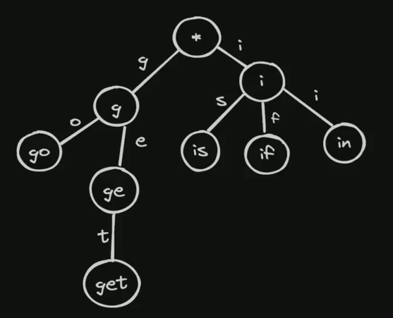

# Trie (Prefix Tree)

- A trie, or prefix tree, is a special type of tree used to store associative data structures.
- It is primarily used for storing strings in a way that allows for efficient retrieval.
- Each node in a trie represents a single character of a string, and the path from the root to a node represents the prefix of the string.
- Use cases include autocomplete systems, spell checkers, and IP routing.

## Trie Structure

- A trie is structured as a tree where each node represents a character
- Words sharing the same prefix share the same path in the tree
- For autocomplete, when a user types "a", we can traverse from the root to the "a" node and then collect all possible word endings by exploring all paths from that node
- This structure allows for efficient O(k) prefix lookups where k is the length of the prefix

## Trie Implementation

```csharp
public class TrieNode
{
    public Dictionary<char, TrieNode> Children { get; set; }
    public bool IsEndOfWord { get; set; }

    public TrieNode()
    {
        Children = new Dictionary<char, TrieNode>();
        IsEndOfWord = false;
    }
}
public class Trie
{
    private TrieNode root;

    public Trie()
    {
        root = new TrieNode();
    }

    // Insert a word into the trie
    public void Insert(string word)
    {
        TrieNode current = root;
        foreach (char c in word)
        {
            if (!current.Children.ContainsKey(c))
            {
                current.Children[c] = new TrieNode();
            }
            current = current.Children[c];
        }
        current.IsEndOfWord = true;
    }

    // Search for a word in the trie
    public bool Search(string word)
    {
        TrieNode current = root;
        foreach (char c in word)
        {
            if (!current.Children.ContainsKey(c))
            {
                return false;
            }
            current = current.Children[c];
        }
        return current.IsEndOfWord;
    }

    // Check if any word in the trie starts with a given prefix
    public bool StartsWith(string prefix)
    {
        TrieNode current = root;
        foreach (char c in prefix)
        {
            if (!current.Children.ContainsKey(c))
            {
                return false;
            }
            current = current.Children[c];
        }
        return true;
    }
}
```
